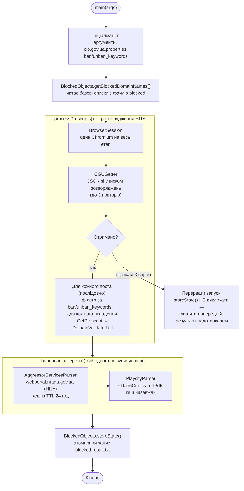
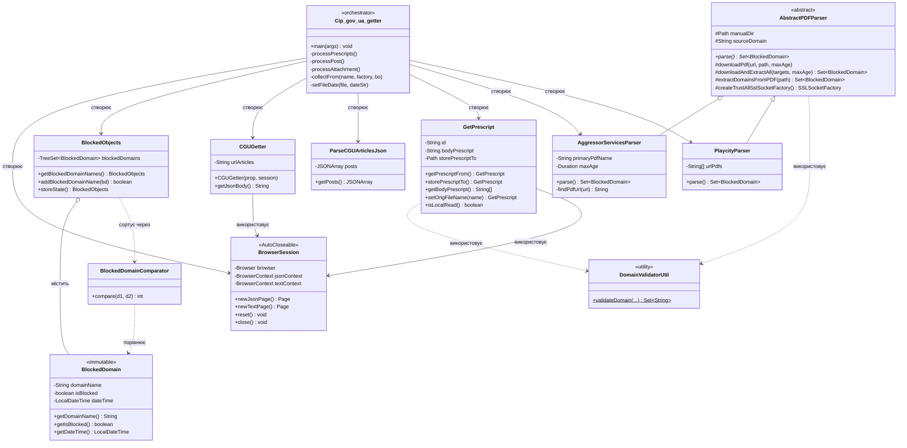
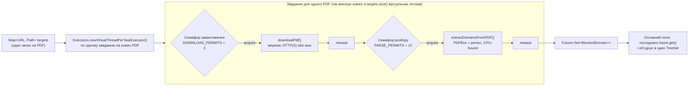

# cip.gov.ua-getter

## Що ми тут робимо?

Читаємо та аналізуємо розпорядження НЦУ, адже є розпорядження НКРЗІ, яке зобов’язує провайдерів щоденно моніторити та виконувати розпорядження НЦУ.

На виході формуємо з текстових даних список доменів, які блокуються на рівні DNS. Утиліта завантажує розпорядження через API, обробляє вкладення (TXT, PDF), валідує домени та формує `blocked.result.txt` із актуальними доменами для блокування.

Починаючи з версії 3.0, утиліта також парсить перелік сервісів держави-агресора з `webportal.nrada.gov.ua` — ще одного сайту НЦУ, — додаючи відповідні домени до `blocked.result.txt`.

Починаючи з версії 3.2, додано парсинг рішень щодо блокування «ПлейСіті» — PDF-файлів, що публікуються на `nkek.gov.ua`. Підтримка `file:`-посилань дозволяє завантажувати PDF-списки без прив'язки до конкретного URL.

## Чого хотілося б?

Хотілося б, щоб НЦУ надало нормальний API для:

- Актуального списку доменів для блокування на рівні DNS.
- Списку AS для блокування на рівні BGP.
- Списку IPv4 та IPv6 для блокування на рівні L3.

Поки що кожен провайдер змушений вигадувати свій велосипед, а НКРЗІ лише каже: "Є розпорядження — виконуйте!" Як? Ну, це вже ваші проблеми… 😅

## Про проект

`cip_gov_ua_getter` — консольна утиліта для збору розпоряджень про блокування доменів із сайту cip.gov.ua. Вона:

- Завантажує розпорядження через API (`articles` та `attachment/download`).
- Кешує вкладення локально в папці `PRESCRIPT`.
- Валідує домени, обробляє гомогліфи та пропускає IP-адреси.
- Формує список заблокованих доменів у `blocked.result.txt` (атомарний запис — без ризику пошкодження файлу).
- Підтримує дебаг-режим для детальних логів.
- Парсить перелік сервісів держави-агресора з `webportal.nrada.gov.ua` — НЦУ (з версії 3.0); кеш PDF має термін придатності й оновлюється автоматично (з версії 3.2.1).
- Парсить рішення щодо «ПлейСіті» з PDF-файлів за списком URL (`urlPdfs`), у т.ч. з `file:`-посилань (з версії 3.2).
- Стійкий до мережевих збоїв: автоматичні повтори запитів, ізоляція збоїв між парсерами.

### Можливості

- **Парсинг сервісів держави-агресора (НЦУ)**: Витягує домени з PDF на `webportal.nrada.gov.ua` і додає їх до `blocked.result.txt`. Локальний кеш PDF придатний `AggressorServices_max_age_hours` годин (типово 24), далі — автоматичне оновлення; якщо сервер недоступний, використовується наявна застаріла копія (без падіння джерела).
- **Парсинг рішень щодо «ПлейСіті»**: Завантажує та обробляє PDF за списком URL із властивості `urlPdfs`. Підтримує `file:/path/to/list.txt` для читання URL зі зовнішнього файлу (рядки з `#` — коментарі, `~` розгортається в домашню директорію).
- **Продуктивність**: ~6 секунд для запусків із локальним кешем, ~30-35 хвилин для першого запуску (залежить від мережі та кількості вкладень).
- **Стійкість до збоїв**: Автоматичні повтори запитів (`CGUGetter` — 3 спроби, `GetPrescript` — 5 спроб). Збій одного парсера не зупиняє обробку інших. Некоректний рядок у `ban_keywords`/`unban_keywords` не ламає весь запуск.
- **Безпечний запис**: `blocked.result.txt`, PDF-файли та кешовані вкладення записуються атомарно (через тимчасовий файл + rename), що виключає пошкодження при аварійному завершенні. Завантажені PDF додатково перевіряються за сигнатурою `%PDF-`.
- **Блокування непотрібних ресурсів**: Ігноруються `.jpg`, `.jpeg`, `.png`, `.svg`, `.woff2`, `.css`, Google Analytics і Google Tag Manager для швидшого завантаження.
- **Гнучке логування**: Режим `-d` для дебаг-логів, чисті логи на `INFO` за замовчуванням.
- **Валідатор доменів**: Перевірка через `commons-validator`, обробка гомогліфів із `icu4j`. Публічні суфікси (`com.ua`, `kiev.ua`, `co.uk`) ніколи не потрапляють у результат — заблокувати такий запис означало б покласти цілу зону.
- **Кешування**: Локальні файли зменшують кількість запитів до API.
- **Конфігурація**: Налаштування через `cip.gov.ua.properties` (шляхи, User-Agent, вхідні/вихідні файли, URL сервісів агресора).

## Архітектура

### Загальний потік виконання



Два ключові рішення для стійкості видно прямо на діаграмі:

- Якщо не вдалося отримати сам перелік розпоряджень (`CGUGetter`) — запуск переривається, а `storeState()` свідомо **не** викликається, щоб не перезаписати робочий `blocked.result.txt` неповними даними.
- `AggressorServicesParser` і `PlaycityParser` ізольовані одне від одного і від решти потоку: збій одного джерела не заважає обробити інше й зберегти результат.

### Структура класів



`AbstractPDFParser` — спільна база для обох PDF-парсерів: завантаження з
per-connection SSL bypass, атомарний запис, паралельний конвеєр
завантаження+розбору. `AggressorServicesParser` і `PlaycityParser`
відрізняються лише тим, *звідки* беруть перелік PDF і чи має кеш термін
придатності (`Duration maxAge`).

### Паралельна обробка PDF

`AbstractPDFParser.downloadAndExtractAll()`, якою користуються обидва
PDF-парсери, якщо документів декілька (наприклад, кілька рішень щодо
«ПлейСіті» за один запуск) — кожен проходить власний конвеєр «завантажити →
розібрати» на віртуальних потоках JDK 21, без бар'єра між фазами:



Дві окремі квоти обмежують навантаження незалежно одна від одної: не
більш як 3 одночасних мережевих завантаження (джерела — держсайти, більше
не потрібно) і не більш як 12 одночасних розборів PDFBox (обмежено
пам'яттю — документ тримається в купі повністю). Збій одного файлу
логується й не зупиняє решту конвеєрів.

## Встановлення

1. **Вимоги**:

   - Java 21+.
   - Maven 3.6+.
   - ~2 ГБ RAM (для Playwright).
   - Debian 11+ або інша ОС із підтримкою Chromium.

2. **Клонування репозиторію**:

   ```bash
   git clone https://github.com/oldengremlin/cip_gov_ua_getter.git
   cd cip_gov_ua_getter
   ```

3. **Встановлення залежностей**:

   ```bash
   mvn clean install
   ```

4. **Створення конфігурації**: Створіть файл `cip.gov.ua.properties` у корені проекту. Приклад:

   ```properties
   urlArticles=https://cip.gov.ua/services/cm/api/articles?page=0&size=1000&tagId=60751
   urlPrescript=https://cip.gov.ua/services/cm/api/attachment/download?id=
   blocked=blocked.txt;blocked.ncu
   blocked_result=blocked.result.txt
   store_prescript_to=./PRESCRIPT
   userAgent=Mozilla/5.0 (X11; Linux x86_64) AppleWebKit/537.36 (KHTML, like Gecko) Chrome/129.0.0.0 Safari/537.36
   secChUa="Chromium";v="129", "Not:A-Brand";v="24", "Google Chrome";v="129"
   urlAggressorServices=https://webportal.nrada.gov.ua/perelik-servisiv-derzhavy-agresora/#perelik
   AggressorServices_SOURCE_DOMAIN=webportal.nrada.gov.ua
   AggressorServices_PRIMARY_PDF_NAME=Perelik.#450.2023.07.06.pdf
   AggressorServices_prescript_to=./PRESCRIPT/MANUAL
   AggressorServices_max_age_hours=24
   # URL PDF-файлів рішень щодо «ПлейСіті»: прямі https:// через кому або file:/path/to/list.txt
   urlPdfs=file:~/domains.txt
   SERVICE_SUBDOMAINS=www,ftp,mail,api,blog,shop,login,admin,web,secure,m,mobile,app,dev,test,m
   ban_keywords=блокування|обмеження доступу|реалізацію.*обмежувальних
   unban_keywords=розблокування|припинення тимчасового
   max_file_size_bytes=10485760
   # Хости, де дозволено обхід перевірки TLS (типово лише nrada)
   ssl_bypass_hosts=webportal.nrada.gov.ua
   ```

## Використання

1. **Збірка JAR**:

   ```bash
   mvn clean package
   ```

2. **Запуск утиліти**:

   - Звичайний режим:

     ```bash
     java -jar target/cip_gov_ua_getter-3.3.1-all.jar
     ```

   - Дебаг-режим:

     ```bash
     java -jar target/cip_gov_ua_getter-3.3.1-all.jar -d
     ```

3. **Результати**:

   - Вкладення зберігаються в `store_prescript_to` (наприклад, `./PRESCRIPT`).
   - Список доменів, включно з сервісами агресора, — у `blocked.result.txt`.
   - Логи — у `logs/cip_gov_ua_getter.log`.

### Приклад вихлопу

- `blocked.result.txt`:

  ```
  example.com
  test.org
  xn--80ak6aa92e.com
  aggressor-service.ru
  ```

- Лог із `-d`:

  ```
  2026-08-11 10:00:00 INFO  n.u.cip_gov_ua_getter.GetPrescript - Fetching prescript for ID 68502 from server
  2026-08-11 10:00:00 DEBUG n.u.cip_gov_ua_getter.BrowserSession - Blocked static resource: https://cip.gov.ua/content/css/loading.css
  2026-08-11 10:00:00 INFO  n.u.c.AbstractPDFParser - Downloaded fresh PDF: /home/olden/.../MANUAL/Perelik.#450.2023.07.06.pdf
  2026-08-11 10:00:01 INFO  n.u.cip_gov_ua_getter.BlockedObjects - Successfully stored blocked domains to blocked.result.txt
  ```

### Конфігурація логування

Логи виводяться в консоль і зберігаються в `logs/cip_gov_ua_getter.log` з щоденною ротацією (30 днів). Налаштування логування задаються в `src/main/resources/logback.xml`. Основні особливості:

- Рівень `INFO` за замовчуванням: чисті логи без зайвих деталей.
- Режим `-d` вмикає рівень `DEBUG` для пакету `net.ukrcom.cip_gov_ua_getter` — ідеально для діагностики.
- Надлишкові дебаг-повідомлення від PDFBox/FontBox прибрано (залишаємо лише важливе!).

Щоб змінити шлях до логів або період ротації, відредагуйте `logback.xml`. Наприклад, змініть `<file>logs/cip_gov_ua_getter.log</file>` на потрібний шлях.

**Створення конфігурації**: Створіть файл `cip.gov.ua.properties` у корені проекту. Приклад із поясненнями:

```
# URL для API зі списком розпоряджень
urlArticles=https://cip.gov.ua/services/cm/api/articles?page=0&size=1000&tagId=60751

# URL для завантаження вкладень
urlPrescript=https://cip.gov.ua/services/cm/api/attachment/download?id=

# Вхідні файли з доменами (через ; для кількох файлів)
blocked=blocked.txt;blocked.ncu

# Вихідний файл із результуючим списком доменів
blocked_result=blocked.result.txt

# Папка для збереження вкладень
store_prescript_to=./PRESCRIPT

# HTTP User-Agent для запитів (імітує браузер)
userAgent=Mozilla/5.0 (X11; Linux x86_64) AppleWebKit/537.36 (KHTML, like Gecko) Chrome/129.0.0.0 Safari/537.36

# Sec-Ch-Ua для JavaScript-запитів (імітує Chrome)
secChUa="Chromium";v="129", "Not:A-Brand";v="24", "Google Chrome";v="129"

# URL для парсингу сервісів держави-агресора
urlAggressorServices=https://webportal.nrada.gov.ua/perelik-servisiv-derzhavy-agresora/#perelik

# Домен джерела для відносних PDF-посилань
AggressorServices_SOURCE_DOMAIN=webportal.nrada.gov.ua

# Ім'я PDF-файлу для сервісів агресора
AggressorServices_PRIMARY_PDF_NAME=Perelik.#450.2023.07.06.pdf

# Папка для збереження PDF
AggressorServices_prescript_to=./PRESCRIPT/MANUAL

# Термін придатності кешу PDF агресора, у годинах. Сайт nrada.gov.ua оновлює
# перелік по-різному — інколи під новим іменем файлу, інколи вміст під тим
# самим — тож кеш за фіксованим іменем без цього застаріває назавжди. Якщо
# сервер недоступний під час оновлення — джерело не провалюється,
# використовується наявна застаріла копія (WARN у лог)
AggressorServices_max_age_hours=24

# URL PDF-файлів рішень щодо «ПлейСіті»: прямі посилання через кому або file:/шлях/до/файлу
# У файлі — по одному URL на рядок; рядки з # ігноруються; ~ → домашня директорія
# Приклади:
#   urlPdfs=https://nkek.gov.ua/...pdf,https://nkek.gov.ua/...pdf
#   urlPdfs=file:~/domains.txt
#   urlPdfs=file:/home/user/nkek_pdfs.txt,https://nkek.gov.ua/extra.pdf
urlPdfs=file:~/domains.txt

# Субдомени для видалення (через кому).
# Зрізаються лише тоді, коли після цього лишається реєстрований домен:
# www.foo.com.ua -> foo.com.ua, але shop.com.ua лишається як є, бо com.ua —
# публічний суфікс, а не сайт
SERVICE_SUBDOMAINS=www,ftp,mail,api,blog,shop,login,admin,web,secure,m,mobile,app,dev,test

# Хости, для яких дозволено обхід перевірки TLS-сертифіката, через кому.
# Потрібен лише через некоректний ланцюжок на webportal.nrada.gov.ua.
# Розширювати цей перелік без потреби небезпечно: на дозволених хостах
# перевірка сертифіката повністю вимикається після першої SSL-помилки
ssl_bypass_hosts=webportal.nrada.gov.ua
```

### Як працює валідація доменів

Утиліта ретельно перевіряє кожен домен, щоб гарантувати коректність списку для блокування:

- **Очищення**: Видаляються протоколи (`https://`, `ftp://`), субдомени (`www`, `mail` тощо), шляхи (`/path`), порти (`:8080`) та параметри (`?key=value`).
- **Перевірка довжини**: Домени довші за 255 символів відкидаються (до і після Punycode).
- **Валідація TLD**: Використовується `commons-validator` для перевірки доменів верхнього рівня.
- **Обробка гомогліфів**: Нелатинські символи (наприклад, кирилиця) нормалізуються через `icu4j` (`SpoofChecker`) і конвертуються в Punycode (`IDN.toASCII`).
- **Фільтрація IP**: IP-адреси пропускаються, адже нас цікавлять лише домени.
- **Кешування**: Використовується `ConcurrentHashMap` для швидкої обробки гомогліфів.
- **Евристичне відновлення склеєних доменів**: `prepareDocument` прибирає переноси рядків у тексті PDF, тож кінець одного домену без схеми інколи злипається з початком наступного посилання (`hd.muvee.me` + `https://...` → `hd.muvee.mehttps`). Якщо домен не пройшов звичайну валідацію, а його хвіст — це `http`, `https`, `ftp` або `htpps` (підтверджений варіант `https` з переставленими літерами — артефакт шрифту в PDF), утиліта пробує прибрати хвіст і перевалідувати результат. Спрацьовує лише як фолбек після невдачі, тож справді биті фрагменти (`77.muvee`) лишаються позначені як `Invalid IDN domain`, як і мають.

Результат: чистий список валідних доменів у `blocked.result.txt`, готовий для DNS-блокування.

## Нотатки для розробників

- **Залежності**:

  - Playwright 1.58.0 (Apache License 2.0)
  - commons-validator 1.10.1 (Apache License 2.0)
  - icu4j 78.2 (Unicode License)
  - logback-classic 1.5.32 (EPL 1.0/LGPL 2.1)
  - json 20251224 (JSON License)
  - pdfbox 3.0.6 (Apache License 2.0)
  - jsoup 1.22.1 (MIT License)
  - guava 33.4.8-jre (Apache License 2.0) — заради `InternetDomainName` з Public Suffix List

- **Логіка роботи**:

  - `CGUGetter`: Завантажує JSON із розпорядженнями (3 автоматичні повтори при збої).
  - `GetPrescript`: Завантажує/читає вкладення, валідує домени (5 повторів).
  - `AggressorServicesParser`: Парсить PDF із сервісами держави-агресора — сайт НЦУ (`webportal.nrada.gov.ua`). Обирає найновіший документ за датою в посиланні. Кеш PDF оновлюється за віком (`AggressorServices_max_age_hours`), а не назавжди — на відміну від `GetPrescript` і `PlaycityParser`, де кожен документ незмінний.
  - `PlaycityParser`: Парсить PDF-рішення щодо «ПлейСіті» за списком URL із `urlPdfs`; підтримує `file:` для читання URL зі зовнішнього файлу.
  - `BlockedObjects`: Формує список заблокованих доменів, записує атомарно.
  - `BlockedDomain`/`BlockedDomainComparator`: Зберігає та сортує домени.
  - `AtomicFiles`: Спільний атомарний запис (тимчасовий файл + rename).
  - `ConfigUtil`: Спільний і кешований розбір конфігурації для класів, що створюються сотні разів за запуск.

- **Майбутні ідеї**:

  - Кешування JSON для зменшення запитів до API.
  - Паралельна обробка вкладень (з обережністю через ризик блокування).
  - Додавання підтримки `.woff`, `.ttf` до блокування ресурсів.

- **Посилання для вивчення**:

  - Jackson JSON Parser
  - JSON Parsing in Java

## Відомі проблеми

- Перший запуск може тривати ~30-35 хвилин через завантаження всіх вкладень.
- Потрібна стабільна мережа, інакше запити можуть завершитися помилкою (записуються в `failed_ids.txt`).
- Debian 11 видає попередження про застарілий WebKit. Рекомендується оновити ОС.

### FAQ

**Чому перший запуск такий довгий?**  
Перший запуск завантажує всі вкладення з API cip.gov.ua, що може зайняти 30-35 хвилин залежно від мережі. Наступні запуски використовують локальний кеш (`PRESCRIPT`) і виконуються за ~6 секунд.

**Як перевірити, які домени додалися?**  
Відкрийте `blocked.result.txt` — там список валідних доменів. У дебаг-режимі (`-d`) логи в `logs/cip_gov_ua_getter.log` покажуть деталі валідації.

**Що робити, якщо API не відповідає?**  
Утиліта автоматично повторює запит: `CGUGetter` — 3 рази з паузою 3 с, `GetPrescript` — 5 разів із випадковою паузою 1–6 с. Якщо всі спроби вичерпані — ID записується в `failed_ids.txt`. Перевірте мережу та спробуйте повторний запуск; наступний раз для вже завантажених файлів використається локальний кеш.

**Чому PDF із сервісів агресора не завантажується?**  
Переконайтеся, що `urlAggressorServices` і `AggressorServices_SOURCE_DOMAIN` у `cip.gov.ua.properties` коректні. Логи вкажуть на проблему (наприклад, 404).

**Як зрозуміти, чи перелік сервісів агресора актуальний, а не застарілий кеш?**  
Дивіться в лог одне з трьох повідомлень: `Downloaded fresh PDF` (щойно оновлено), `Cached PDF is still fresh … skipping download` (кеш ще не застарів, усе гаразд) або `Failed to refresh stale cached PDF, falling back to on-disk copy` (сервер недоступний, використано застарілу копію — варто перевірити мережу чи сам сайт nrada.gov.ua). Термін придатності задається `AggressorServices_max_age_hours` (типово 24 години).

**Чому домен із розпорядження не потрапив у результат?**  
Найімовірніші причини видно в лозі. `Refusing to block a public suffix` — ім'я звелося до публічного суфікса (`com.ua`, `co.uk`), блокувати який означало б покласти цілу зону. `Invalid TLD` — домен верхнього рівня не пройшов перевірку. `Skipping IP address` — це IP, а не домен. У дебаг-режимі (`-d`) видно й проміжні кроки очищення.

**Що означає `SSL verification failed … not listed in ssl_bypass_hosts`?**  
Джерело віддало некоректний сертифікат, а його хоста немає в `ssl_bypass_hosts`, тож утиліта відмовилася вимикати перевірку — це навмисно. Якщо хост справді ваш і сертифікат справді зламаний, додайте його до `ssl_bypass_hosts`. Якщо ні — це привід перевірити, чи не підміняє хтось трафік.

**Як вимкнути логування у файл?**  
Відредагуйте `logback.xml`, прибравши `<appender-ref ref="FILE" />` із потрібних логерів.

### Внесок у проєкт

Хочете зробити утиліту ще крутішою? 😎 Ми відкриті до ідей, патчів і пропозицій! Ось як можна долучитися:

- **Повідомте про баг**: Створіть [issue](https://github.com/oldengremlin/cip_gov_ua_getter/issues) з описом проблеми.
- **Запропонуйте фічу**: Поділіться ідеєю в issues — від паралельної обробки до підтримки нових форматів.
- **Надішліть Pull Request**: Форкніть репо, зробіть зміни і надішліть PR. Не забудьте описати, що ви додали!
- **Переклад документації**: Допоможіть перекласти `README.md` чи `LICENSE-UKR.md` іншими мовами.

Перед внеском ознайомтеся з [Apache License 2.0](LICENSE). Давайте будувати велосипеди разом! 🚴

## Ліцензія

Apache License 2.0. Див. [LICENSE](LICENSE) та [NOTICE](NOTICE).  
Пояснення українською: [LICENSE-UKR.md](LICENSE-UKR.md).

## Пов'язані проєкти

- [AS12593-BLOCK](https://github.com/oldengremlin/AS12593-BLOCK.git) —
  практичні результати роботи двох проєктів, `cip_gov_ua_getter` і
  ASBlockWar.
- [ASBlockWar](https://github.com/oldengremlin/asblockwar.git) — суміжний
  проєкт, над яким ведеться паралельна робота.

## Історія змін

Повний перелік змін за версіями — у [CHANGELOG.md](CHANGELOG.md).

## Контакти

Питання, баги, ідеї? Відкривайте [issues](https://github.com/oldengremlin/cip_gov_ua_getter/issues) в репозиторії.

